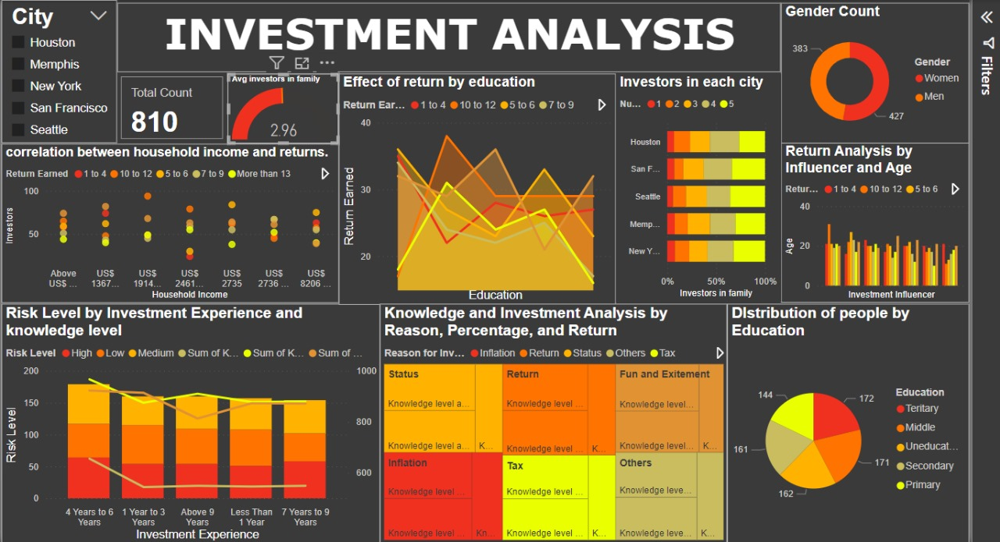

# Investment Recommendation System

## Problem Statement

The project aims to develop a robust recommendation system for investment decisions, utilizing machine learning methodologies and thorough data analysis. By delving into demographic distributions, employment particulars, and investment behaviors, the objective is to identify key factors influencing successful investment outcomes.

## How to Run

1. Clone the repository to your local machine.
2. Ensure you have Python installed on your system.
4. Run the Streamlit app using the command `streamlit run visulaise.py`.
5. Follow the prompts to input data and obtain predictions for risk levels.

## Data Exploration

- Utilized PowerBI to create an infographic.
- Detailed analysis of investment patterns and their correlation with demographic and socioeconomic factors.
- Explored relationships between household income, education, and investment returns across different cities.
- Investigated variations in risk levels based on investor experience and knowledge.
- Provided insights into reasons for investing across different knowledge levels.
- Presented a distribution of investors across various education levels.
- Offers a comprehensive overview to aid in identifying factors influencing optimal investment decisions.

## Preprocessing

- Handled missing values in the "Return Earned" column and replaced them accordingly.
- Encoded categorical variables using one-hot encoding to convert them into numerical format.
- Removed instances with non-numeric values such as "Don't Want to Reveal" in the "Percentage of Investment" column.
- Applied dummy encoding for categorical features and performed feature engineering to calculate the average knowledge level.
- Extracted numerical values from the "Household Income" column and preprocessed textual values in the "Return Earned" column.
- Finally, exported the processed dataset to a new Excel file named "dataset1.xlsx" for further analysis and modeling.

## Model

- RandomForestClassifier was chosen for its ability to handle high-dimensional data and complex feature relationships, making it suitable for predicting risk levels based on demographic and behavioral data.
- This ensemble learning method aggregates multiple decision trees, providing robust and accurate predictions for both binary and multiclass classification problems.
- Default parameters were used for simplicity, but they can be fine-tuned for optimal performance using techniques like grid search or random search.
- Feature selection was conducted with SelectFromModel to retain the most important features, reducing dimensionality and computational complexity while improving model performance.
- Evaluation metrics such as accuracy, precision, recall, and F1 score demonstrated the effectiveness of feature selection in enhancing model performance.

## UI / PowerBI Report

- PowerBI was utilized for creating an interactive and visually appealing infographic, offering a comprehensive overview of investment patterns and demographic correlations.
- Streamlit was employed to develop a user-friendly interface for interactive data input, allowing users to seamlessly input data and obtain real-time predictions of risk levels based on the machine learning model.

